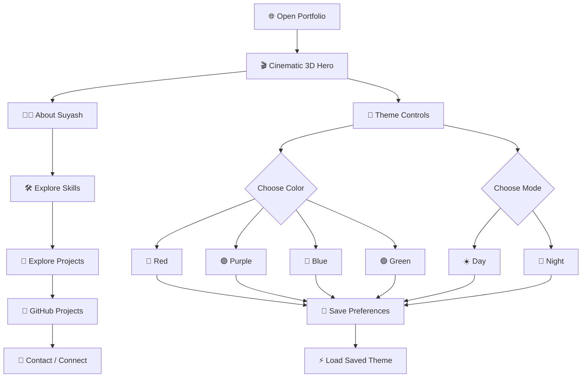
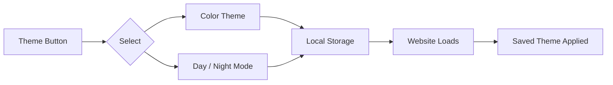

# 🌌 Suyash — 3D Portfolio

<p align="center">
  <a href="https://s4yush.github.io/my-portfolio/">
    
  </a>
</p>

An interactive, cinematic 3D portfolio website built to showcase my profile, skills, and projects.

## 🔄 How The Website Works



## 🎯 Project Flow

**User enters the website →**

1. **Hero Section** — Cinematic 3D animation introduces Suyash.
2. **About Section** — First-year B.Tech student interested in CSE.
3. **Skills Section** — Python, Git & GitHub, and Computer Science learning.
4. **Projects Section** — Current work and upcoming projects.
5. **GitHub Integration** — Direct access to my GitHub projects.
6. **Contact Section** — Connect and collaborate.

## 🎨 Theme System



### 🎨 Available Colors

`Red` · `Purple` · `Blue` · `Green`

### 🌓 Modes

`Day` · `Night`

Color and mode preferences are stored separately.

## 🧩 Project Structure

```text
my-portfolio/
├── index.html
├── css/
│   └── style.css
└── js/
    ├── space.js
    ├── theme.js
    └── ui.js
```

## 🚀 Run Locally

```bash
git clone https://github.com/s4yush/my-portfolio.git
cd my-portfolio
```

Then open `index.html` in your browser.

## 📂 Projects

More projects are coming soon.

## 🔗 Connect

- GitHub: https://github.com/s4yush

---

### CODE • LEARN • BUILD • GROW

Made by **Suyash**.
